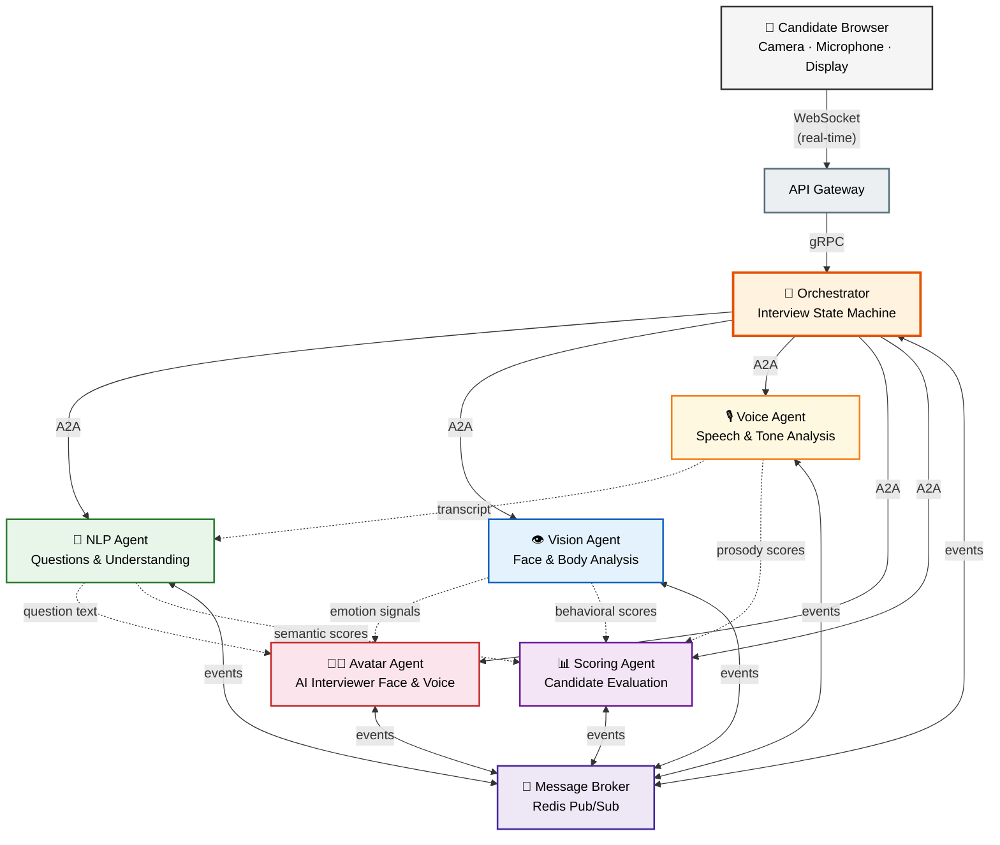
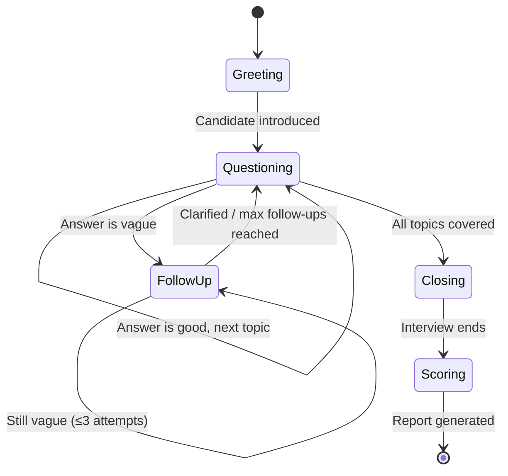
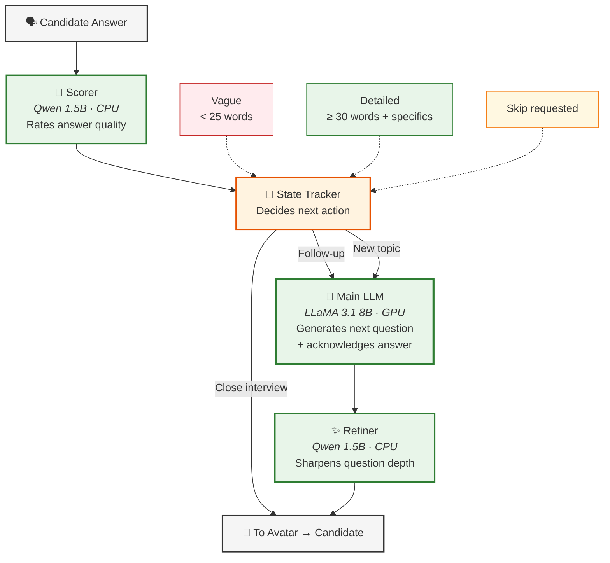
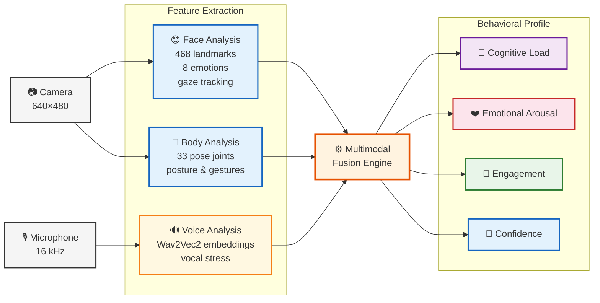
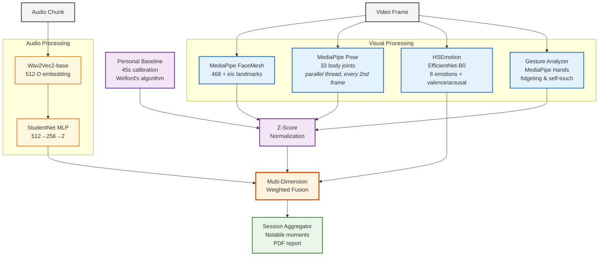
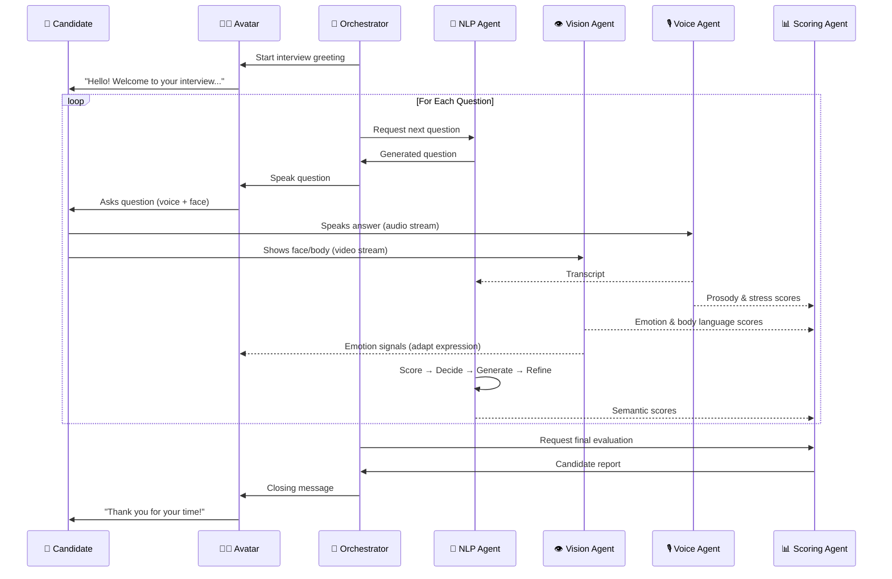
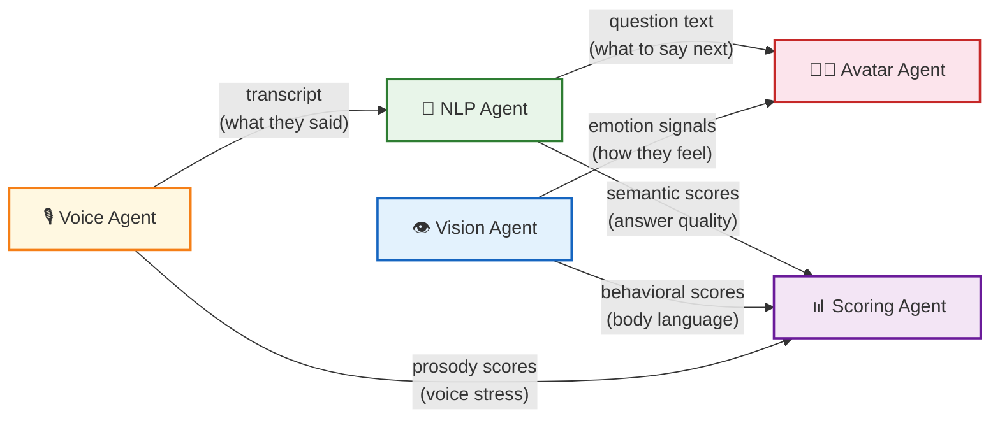

# AI Recruiter — Presentation Diagrams (Mermaid Code)

Use these in any tool that supports Mermaid (PowerPoint plugins, Mermaid Live Editor, draw.io import, etc.).
Render at: https://mermaid.live

---

## 1. Global System Architecture

---

## 2. Orchestrator Interview Flow (State Machine)

---

## 3. NLP Agent Pipeline (3-LLM Chain)

---

## 4. Vision Agent — Multimodal Stress Detection Pipeline

---

## 5. Vision Agent — Detailed Technical Pipeline

---

## 6. End-to-End Interview Flow (Sequence)

---

## 7. Inter-Agent Data Flow

---

## Rendering Instructions

**Option A — Mermaid Live Editor:**  
Paste any code block into https://mermaid.live → export as SVG/PNG

**Option B — VS Code Preview:**  
Install "Markdown Preview Mermaid Support" extension → preview this file

**Option C — PowerPoint:**  
Export as SVG from Mermaid Live → Insert as image in slides

**Option D — draw.io:**  
Use Mermaid import plugin or recreate from the structure
