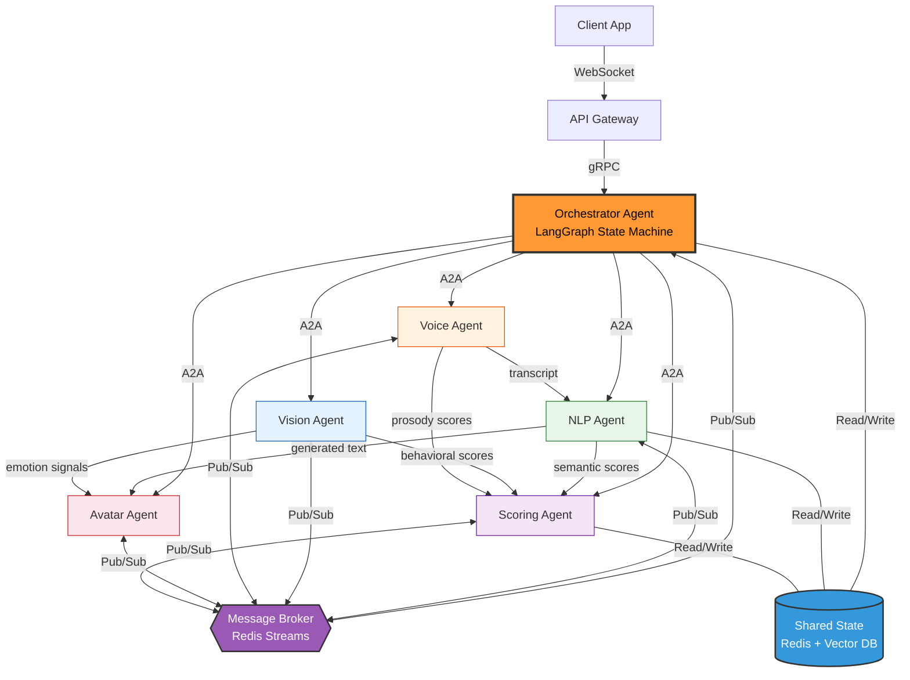

# AI Recruiter - Agentic Architecture

### Protocol Legend

| Protocol | Purpose |
|----------|---------|
| **A2A** | Orchestrator dispatches tasks to agents |
| **Pub/Sub** | Async event broadcasting via broker |
| **gRPC** | Gateway → Orchestrator |
| **WebSocket** | Real-time client streaming |

### Inter-Agent Data Flows

| From | To | Data |
|------|----|------|
| Voice Agent | NLP Agent | Candidate transcript (ASR output) |
| NLP Agent | Avatar Agent | Generated question text for TTS + lip sync |
| Vision Agent | Avatar Agent | Emotion signals to adapt avatar expressions |
| NLP Agent | Scoring Agent | Semantic & communication scores |
| Vision Agent | Scoring Agent | Behavioral & emotion scores |
| Voice Agent | Scoring Agent | Prosody & stress scores |
